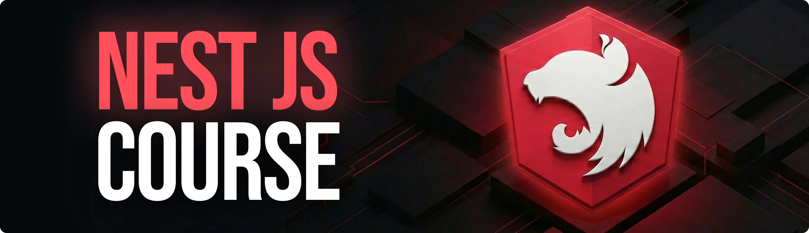
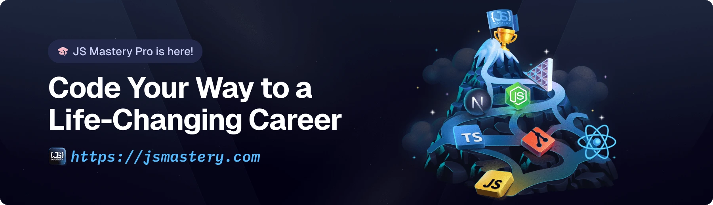

<div align="center">
  <br />
    <a href="https://youtu.be/Q6NpiIp-6WM" target="_blank">
      
    </a>
  <br />

  <div>

</


  </div>

  <h3 align="center">Hackathon | NestJS Course</h3>

   <div align="center">
     Build this project step by step with our detailed tutorial on <a href="https://www.youtube.com/watch?v=XUkNR-JfHwo" target="_blank"><b>JavaScript Mastery</b></a> YouTube. Join the JSM family!
    </div>
</div>

## 📋 <a name="table">Table of Contents</a>

1. ✨ [Introduction](#introduction)
2. ⚙️ [Tech Stack](#tech-stack)
3. 🔋 [Features](#features)
4. 🤸 [Quick Start](#quick-start)
5. 🔗 [Assets](#links)
6. 🚀 [More](#more)

## 🚨 Tutorial

This repository contains the code corresponding to an in-depth tutorial available on our YouTube channel, <a href="https://www.youtube.com/@javascriptmastery/videos" target="_blank"><b>JavaScript Mastery</b></a>.

If you prefer visual learning, this is the perfect resource for you. Follow our tutorial to learn how to build projects like these step-by-step in a beginner-friendly manner!

<a href="https://youtu.be/Q6NpiIp-6WM" target="_blank"></a>

## <a name="introduction">✨ Introduction</a>

Hackathon Backend is a scalable API built with NestJS for managing hackathons. It offers user authentication, hackathon CRUD operations, project submissions with file uploads, asynchronous processing, and email notifications, all secured with modern technologies.

If you're getting started and need assistance or face any bugs, join our active Discord community with over **50k+** members. It's a place where people help each other out.

<a href="https://discord.com/invite/n6EdbFJ" target="_blank"></a>

## <a name="tech-stack">⚙️ Tech Stack</a>

- **[NestJS](https://nestjs.com/)** is a progressive Node.js framework for building efficient, reliable, and scalable server-side applications. It leverages TypeScript and combines elements of OOP (Object Oriented Programming), FP (Functional Programming), and FRP (Functional Reactive Programming) to provide a modular and highly testable architecture.

- **[Prisma](https://www.prisma.io/)** is a next-generation ORM (Object-Relational Mapping) for TypeScript and Node.js. It features an intuitive data model, automated migrations, type-safety, and auto-completion, allowing developers to read and write data to databases with minimal boilerplate.

- **[PostgreSQL](https://www.postgresql.org/)** is an advanced, open-source relational database management system. Known for its reliability, feature robustness, and performance, it supports both SQL and JSON querying, making it ideal for handling complex data workloads.

- **[Better Auth](https://www.better-auth.com/)** is a complete, open-source authentication and authorization solution. It provides a framework-agnostic approach to integrating secure user sessions, social sign-ons, and multi-factor authentication with deep TypeScript type-safety.

- **[BullMQ](https://bullmq.io/)** is a premium message queue and batch processing library for Node.js based on Redis. It helps handle distributed jobs, delayed tasks, and high-concurrency background processing with strong atomicity and durability.
  
- **[Arcjet](https://jsm.dev/nestjs-arcjet)** is an advanced security layer for applications that helps developers protect their code against malicious attacks. It integrates directly into the application code to handle rate limiting, bot protection, email verification, and sensitive data masking.
  
- **[Nodemailer](https://nodemailer.com/)** is a popular module for Node.js applications that allows for easy email sending. It supports secure connections (TLS/STARTTLS), HTML content, attachments, and various transport methods, including SMTP, Amazon SES, and Sendmail.

## <a name="features">🔋 Features</a>

🔐 **Authentication (`/api/auth`)**: User registration, login, and role-based access control with secure session management and TypeScript type-safety.

🏆 **Hackathon Management (`/hackathon`)**: Complete CRUD operations for hackathons, team formations, and streamlined participant registration.

📁 **Project Submissions (`/submission`)**: Dedicated file upload support with resilient, asynchronous background processing powered by BullMQ.

📧 **Email Notifications**: Automated, transactional email systems for real-time updates on hackathon events, status changes, and successful submissions.

🛡️ **Security**: Native Arcjet integration to protect your application from malicious threats, bots, and brute-force attacks with intelligent rate limiting.

And many more, including code architecture and reusability.

## <a name="quick-start">🤸 Quick Start</a>

Follow these steps to set up the project locally on your machine.

### Prerequisites

Make sure you have the following installed on your machine:

- **[Node.js](https://nodejs.org/)** (v18 or higher)
- **[npm](https://www.npmjs.com/)** or **[Yarn](https://yarnpkg.com/)**
- **[PostgreSQL](https://www.postgresql.org/)** database
- **[Redis](https://redis.io/)** instance


### Installation steps

Clone the repository:

   ```bash
   git clone https://github.com/JavaScript-Mastery-Pro/Hackathon-backend.git
   cd Hackathon-backend
   ```

Install dependencies:

   ```bash
   npm install
   ```

Set up the database:

   ```bash
   npm run db:migrate
   ```

Generate Prisma client:

   ```bash
   npm run db:generate
   ```

Start the development server:
   ```bash
   npm run start:dev
   ```

### Set Up Environment Variables

Create a new file named `.env` in the root of your project and add the following content:

```env
PORT=8080
BACKEND_URL="http://localhost:8080"
FRONTEND_URL="http://localhost:3000"
AUTH_SECRET="your-auth-secret-here"
DATABASE_URL="your-postgresql-database-url"
REDIS_URL="your-redis-url"
SMTP_HOST="smtp.gmail.com"
SMTP_PORT=587
SMTP_USERNAME="your-email@gmail.com"
SMTP_PASSWORD="your-app-password"
ARCJET_ENV=development
ARCJET_KEY=your-arcjet-key
```

Replace the placeholder values with your real credentials. You can get these by signing up or generating secrets at: [**Better Auth**](https://www.better-auth.com/), [**Arcjet**](hhttps://jsm.dev/nestjs-arcjet), and your database providers.


## <a name="links">🔗 Assets</a>

Assets and snippets used in the project can be found in the **[video kit](https://jsmastery.com/video-kit/36a63254-411e-4640-a581-3b3a05328ebe)**.

<a href="https://jsmastery.com/video-kit/36a63254-411e-4640-a581-3b3a05328ebe" target="_blank">
  
</a>

## <a name="more">🚀 More</a>

**Advance your skills with our Pro Course**

Enjoyed creating this project? Dive deeper into our PRO courses for a richer learning adventure. They're packed with
detailed explanations, cool features, and exercises to boost your skills. Give it a go!

<a href="https://jsm.dev/nestjs-jsm" target="_blank">
  
</a>
